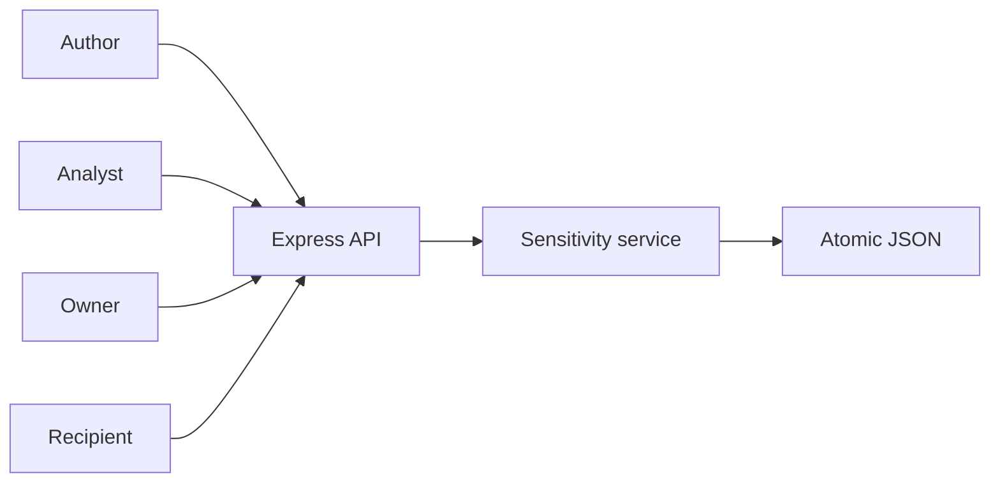
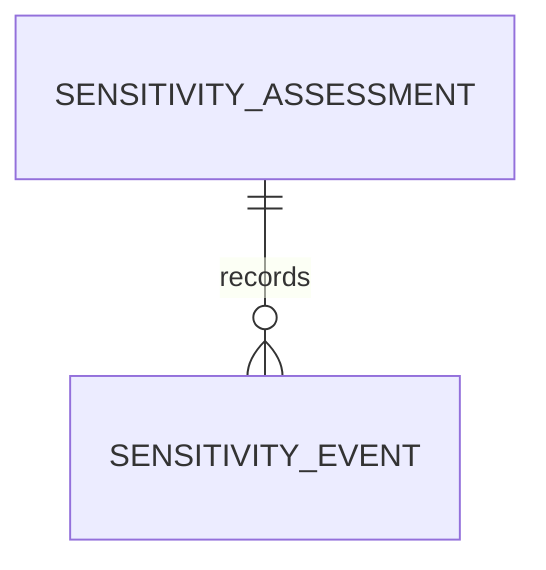
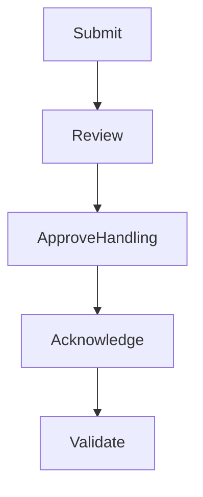
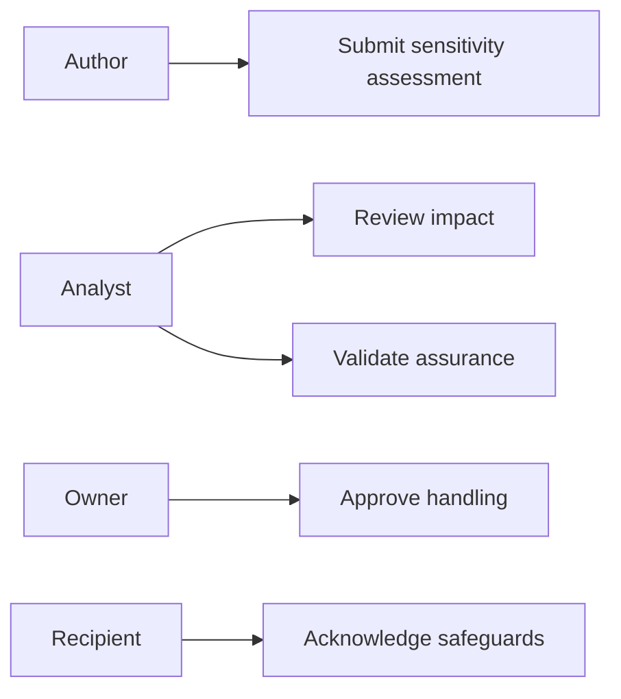
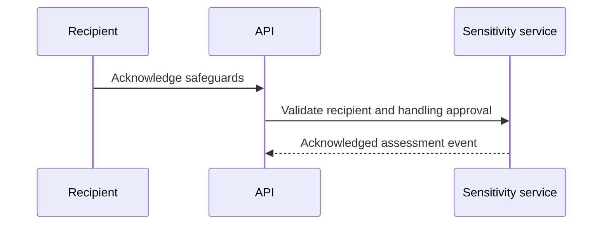

# Supplier Evidence Access Sensitivity Assurance Platform
## The Problem
Not all supplier evidence has the same exposure impact. Commercial financials, security material, and restricted operational records require handling safeguards that must be reviewed, approved, acknowledged by the recipient, and validated before controlled access is considered assured.
## The Solution
This service manages an evidence sensitivity assessment. The analyst records impact, the owner approves the handling controls, the named recipient acknowledges the safeguards, and the analyst validates the controlled access posture as assured.
## Live Demo and Tech Stack
Run `http://localhost:59000/health`. The stack uses Node.js 22, Express 5, atomic JSON persistence, Vitest, and GitHub Actions. The service binds to `0.0.0.0` for LAN operation.
## Local Setup and Run Instructions
```bash
npm install
npm test
env -u PORT node server.mjs
```
## System Documentation
### System Architecture Diagram

### Entity Relationship Diagram

### Data Flow Diagram

### Use Case Diagram

### Sequence Diagram

## Owner

Created and maintained by Kholipha Ahmmad Al-Amin.

Software Engineer and AI Specialist

Founder and CEO of EquiSaaS BD

Principal Consultant at AR IT Consultancy

Full Stack Developer and SaaS Product Builder

### Official links

Portfolio: https://kholipha-ahmmad-al-amin.equisaas-bd.com/

GitHub: https://github.com/kholipha-ahmmad-al-amin

LinkedIn: https://www.linkedin.com/in/kholipha-ahmmad-al-amin

X: https://x.com/al_amin5519

Facebook: https://www.facebook.com/kholipha.ahmmad.al.amin

Instagram: https://www.instagram.com/kholipha.ahmmad.al.amin

## Ownership

This project was created and is maintained by Kholipha Ahmmad Al-Amin.

